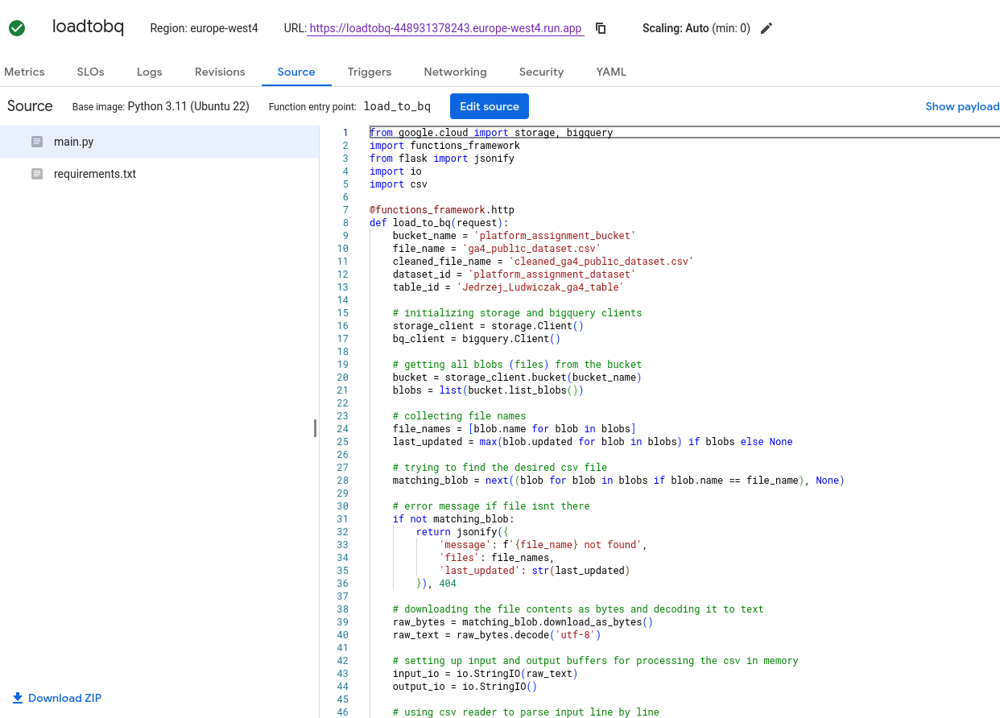
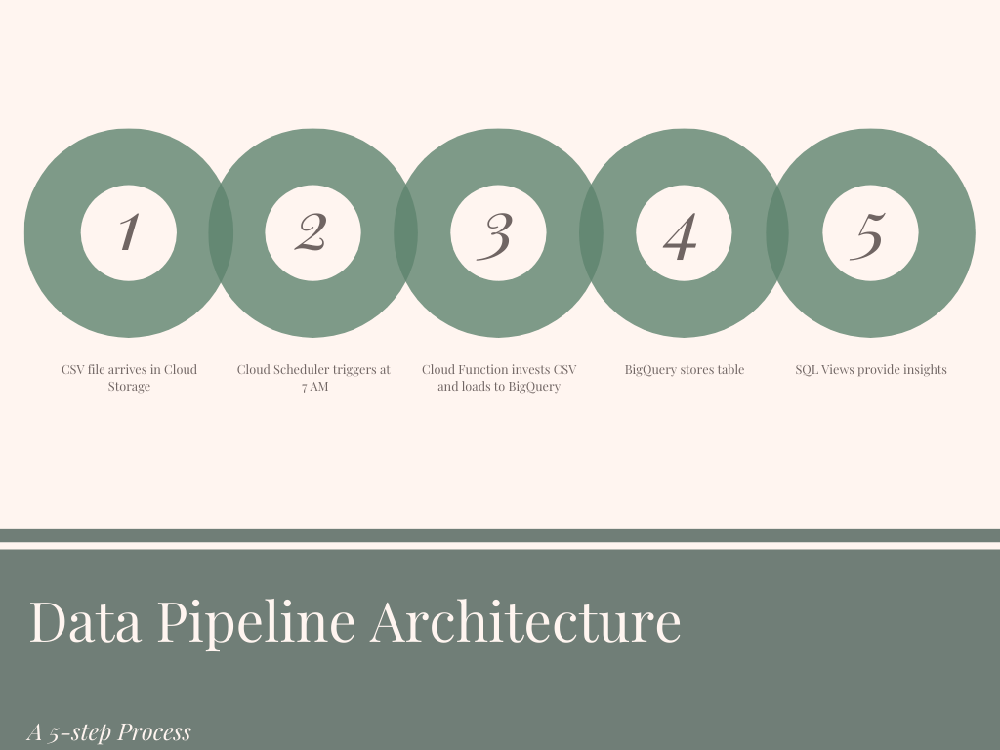

## Presentation of Results

### 1. Introduction
This project delivers a GA4 data pipeline solution to automate the ingestion, validation, and analysis of daily CSV files stored in a Google Cloud Storage bucket. The task required designing a system to process files arriving at 7 AM CEST in the `platform_algorithm_bucket` within the `europe-west4` region, validating them against a schema, and loading them into BigQuery for actionable insights. The solution leverages Cloud Functions, SQL views, and a scheduled workflow, with deliverables including documentation, an architecture diagram, SQL views, and source code, all organized in this GitHub repository.

### 2. Walkthrough

#### Step 1: Setting Up the Environment
Setting up the environment lays the groundwork for the pipeline. Logging into the Google Cloud Console with access to the `crystalloids-candidates` project provides essential permissions like BigQuery Data Editor and Storage Admin. 

#### Step 2: CSV File Arrives in Cloud Storage
The process begins as the CSV file arrives in Cloud Storage, triggering the pipeline. The file, named `ga4_public_dataset.csv`, is uploaded to the `platform_algorithm_bucket` in the `europe-west4` region, adhering to the defined schema. 

#### Step 3: Cloud Scheduler Triggers at 7 AM
Cloud Scheduler triggers the workflow at 7 AM CEST to process the new file, ensuring timely data handling. This scheduled task integrates with the Cloud Function to automate the pipeline. 

#### Step 4: Cloud Function Ingests CSV and Loads to BigQuery
The Cloud Function ingests the CSV file, validates it against the schema, and loads it into BigQuery for analysis. This Python-based function, deployed in the `europe-west4` region, stores its code in the `src/` folder. 

#### Step 5: BigQuery Stores Table
BigQuery stores the data in a table within the `ga4_public_dataset` dataset upon the initial load. The table forms automatically with an inferred or predefined schema, ready for querying. 

#### Step 6: SQL Views Provide Insights
SQL views provide actionable insights by analyzing the stored data, leveraging scripts in the `sql/` folder. These views compute metrics like top page titles by page views, enhancing decision-making. 

#### Step 7: Documenting the Solution
Documenting the solution concludes the process with essential resources. The architecture diagram and technical requirements, located in the `docs/` folder, detail the 5-step pipeline design. 
